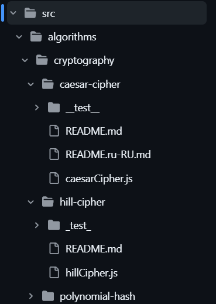
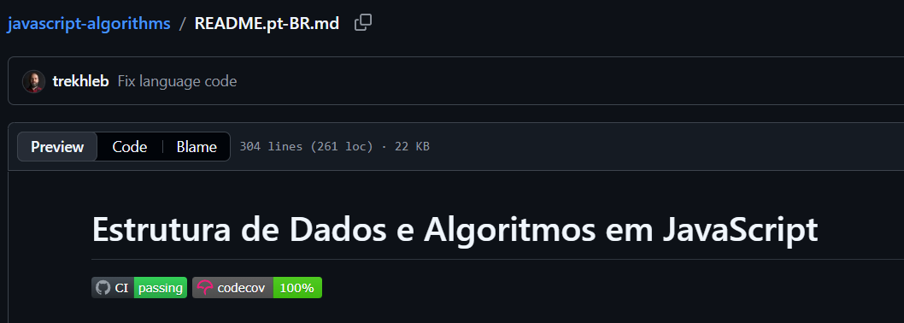

# Explorando Práticas de Teste

Neste exercício, vamos explorar práticas de teste em sistemas reais utilizando a ferramenta [TestMiner](https://andrehora.github.io/testminer).

O TestMiner permite visualizar e analisar testes de software em repositórios do GitHub, fornecendo dados sobre como os projetos organizam seus testes, como eles evoluem entre versões e quais bibliotecas de teste são utilizadas.
Explore a ferramenta antes de começar para se familiarizar com seu funcionamento.

Mais detalhes no GitHub da ferramenta: https://github.com/andrehora/testminer.

---

## Passo 1: Selecionar um repositório

Escolha um repositório real que possua testes de software.
Abaixo estão alguns links para ajudá-lo a encontrar projetos interessantes:

- Python: https://github.com/topics/python?l=python
- JavaScript: https://github.com/topics/javascript?l=javascript
- TypeScript: https://github.com/topics/typescript?l=typescript
- Java: https://github.com/topics/java?l=java

- Tópicos: [ai](https://andrehora.github.io/testminer/#topic:ai), [llm](https://andrehora.github.io/testminer/#topic:llm), [api](https://andrehora.github.io/testminer/#topic:api), [nodejs](https://andrehora.github.io/testminer/#topic:nodejs), [android](https://andrehora.github.io/testminer/#topic:android)

- Por organização: [Google](https://andrehora.github.io/testminer/#google), [Microsoft](https://andrehora.github.io/testminer/#microsoft), [Apple](https://andrehora.github.io/testminer/#apple), [Facebook](https://andrehora.github.io/testminer/#facebook), [Netflix](https://andrehora.github.io/testminer/#netflix), 
[GitHub](https://andrehora.github.io/testminer/#github), [Apache](https://andrehora.github.io/testminer/#apache), [HuggingFace](https://andrehora.github.io/testminer/#huggingface)

## Passo 2: Explorar o repositório selecionado

Busque o repositório escolhido no [TestMiner](https://andrehora.github.io/testminer) e analise os dados de teste gerados pela ferramenta.

## Passo 3: Explicar uma prática de teste

Escolha uma prática ou dado de teste relevante e explique com suas próprias palavras.

---

## Instruções de entrega

1. Faça um `fork` deste repositório (saiba mais sobre forks [aqui](https://docs.github.com/pt/pull-requests/collaborating-with-pull-requests/working-with-forks/fork-a-repo)).
2. Responda às questões abaixo diretamente neste arquivo `README.md` do seu fork. Pode adicionar imagens para enriquecer sua explicação.
3. No Moodle, submeta apenas a URL do seu fork.

---

## Respostas

Repositório: `https://github.com/trekhleb/javascript-algorithms`

URL TestMiner: `https://andrehora.github.io/testminer/#trekhleb/javascript-algorithms`

Explicação:
Nesse repositório, podemos observar algumas práticas de teste muito comuns e importantes,a principal delas é a co-localização de testes. 
Se você explorar as pastas dentro de `src/`, vai perceber que a maioria dos algoritmos e estruturas de dados possui uma subpasta 
chamada `__test__` com os arquivos de teste (por exemplo: `caesarCipher.test.js`) posicionada exatamente ao lado do arquivo de 
implementação (`caesarCipher.js`). Além disso, de quase 360 arquivos `.js` no código-fonte, quase metade (cerca de 177) são arquivos 
exclusivos de teste. Isso facilita muito a navegação e a manutenção: quando você altera um algoritmo, o teste dele está literalmente 
ao lado, garantindo que o desenvolvedor não se esqueça de atualizá-lo.

Outra prática forte adotada pelo repositório é o uso de Integração Contínua (CI) e monitoramento de cobertura de código. 
O projeto utiliza a ferramenta Jest para rodar os testes, e no arquivo `package.json` existe um script (`npm run ci`) que obriga 
o linter e a checagem de cobertura a passarem juntos. Na página inicial do projeto, eles até exibem "badges" do Codecov, mostrando 
que as contribuições de novos algoritmos não quebram o código existente e mantêm a qualidade do software alta.

